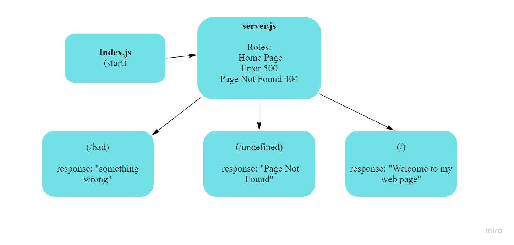

# server-deployment-practice

## a Node.js development , deploy a web server using CI and CD

## Links

* [Pull request](https://github.com/En-ZUH/server-deployment-practice/pulls)
* [Github Actions](https://github.com/En-ZUH/server-deployment-practice/actions)
* [Deployed App to Heroku /branch](https://enas-server-deploy-dev.herokuapp.com/)
* [Deployed App to Heroku /production](https://enas10-server-deploy-prod.herokuapp.com/)

## Setup

* express  
* (.env) file
  * PORT=3000

## Dependencies needs to install

* npm init
* npm i -D jest supertest eslint
* npm i dotenv express

## To Run the Application

1. clone the repository
2. run the command (nodemon)
3. Endpoints:
      * /

       Return "Welcome to my web page"

      * /bad

       Return "something wrong"

      * '*'

       Return  "Page Not Found"

## Testing

* test file (server.test.js)

* run the command( npm test)

## Uml Diagram

